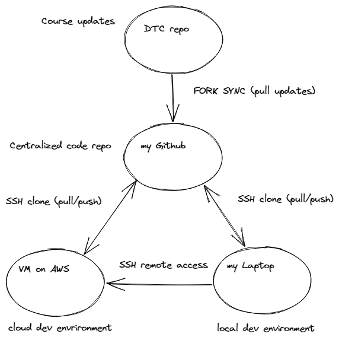

# MLOps Zoomcamp Notes Week1

Sun, May 21, 2023 3:39 PM

## Setup of the development environment for the course

In a video of this week, Alexey shows how to setup a rented VM in AWS with these characteristics:

* Ubuntu 22.04,
* 16GB of RAM,
* instance type t3.xlarge (4 vCPU),
* 30GB of EBS storage.

The instance type is outside of the free tier resources; an approximate estimate for a workload of `10hrs/week` is `10-20$/month`.

My personal setup is depicted in the figure below. I have duplicated the dev environment (both cloud and local). It is clearly redundant with respect to the needs of the course; my scope is to learn how to work in the cloud but to be safe with respect to cloud expenses, by doing the most of my work locally. <strong>I can do so, because I have sufficient local hardware resources</strong>. My local settings for the environment are Ubuntu 20.04 in WSL2 in a Windows 11 machine (i7-11th gen 4-cores processor, 24GB RAM)



I have created a centralized Github repo that is a fork of the DataTalkClub course repo. This allows me to sync my fork from the DTC source repo without pushing back my personal course work. To have all development jobs in sync between local and cloud dev environments, I regularly do pulls from my Github repo to local and cloud dev.

## Software installations

### Initial installations useful throughout the rest of the course

| cloud dev env | local dev env |
| ------------- | ------------- |
| Anaconda-latest | Miniconda |
| Docker.io | connecting Docker Desktop to WSL |
| Docker compose | included in Docker Desktop |

### Installations (in a virtual environment for the week)

Poetry virtual environment with conda Python 3.9.16 interpreter and the following dependencies (`pyproject.toml`) in the local env:

```
[tool.poetry]
name = "01-intro"
version = "0.1.0"
description = ""
authors = ["lucapug <lucapug@gmail.com>"]
readme = "README.md"
packages = [{include = "01_intro"}]

[tool.poetry.dependencies]
python = "^3.8"
jupyter = "^1.0.0"
pandas = "^2.0.1"
seaborn = "^0.12.2"
matplotlib = "^3.7.1"
scikit-learn = "^1.2.2"
fastparquet = "^2023.4.0"


[build-system]
requires = ["poetry-core"]
build-backend = "poetry.core.masonry.api"
```