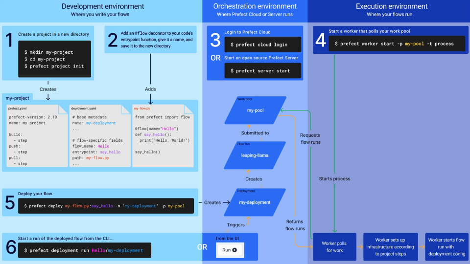
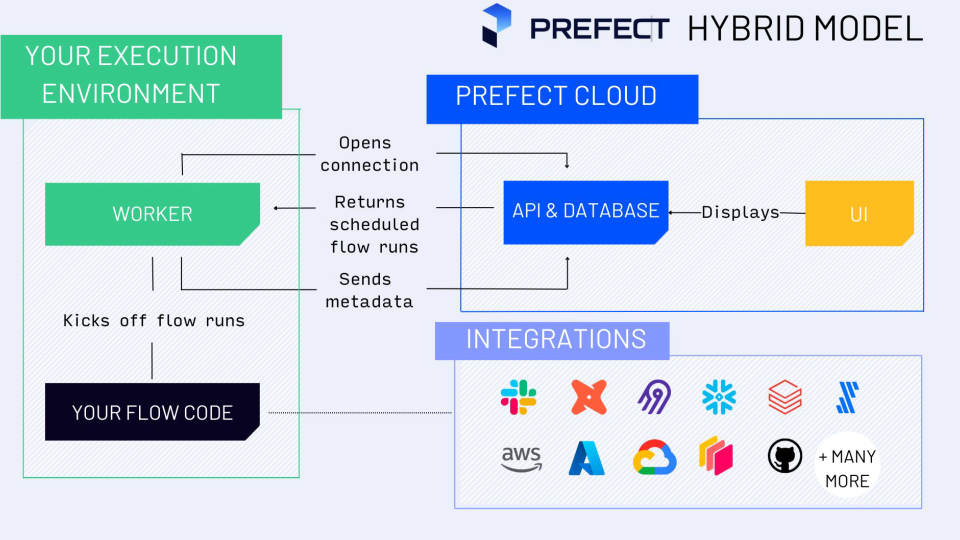

## MLOps zoomcamp notes for week 4 (workflow orchestration with Prefect)

**Terminology:**
<strong>task</strong>: discrete unit of work in a workflow
<strong>flow</strong>: container for workflow logic (flows are parent functions used to call task functions)
different tasks are logically connected inside flows.
Flows can also call subflows

Before starting to use prefect we need to install it locally, then starting the local API server (`prefect server start`) or connecting to the cloud server (`prefect cloud login`). In the last case we need an API key.

To manage both cloud and local use cases, we can set **Prefect Profiles** (one for local the other for cloud) and switch easily between the two configurations

We have worked all the week with **Prefect Projects** (useful for flow deployments, especially for multiple ones)

The folder where prefect `project init` is launched must be the same used to initialize the git repo (`git init` launched here)

Deployments elevate workflows from functions that we call manually to API-managed entities. A deployment is a server-side concept that encapsulates a flow, allowing it to be scheduled and triggered via API.

### Deployment schema

### Prefect Hybrid Model (Separations of concerns)

Your flow code runs on your infrastructure. Prefect Cloud stores only metadata and logs

