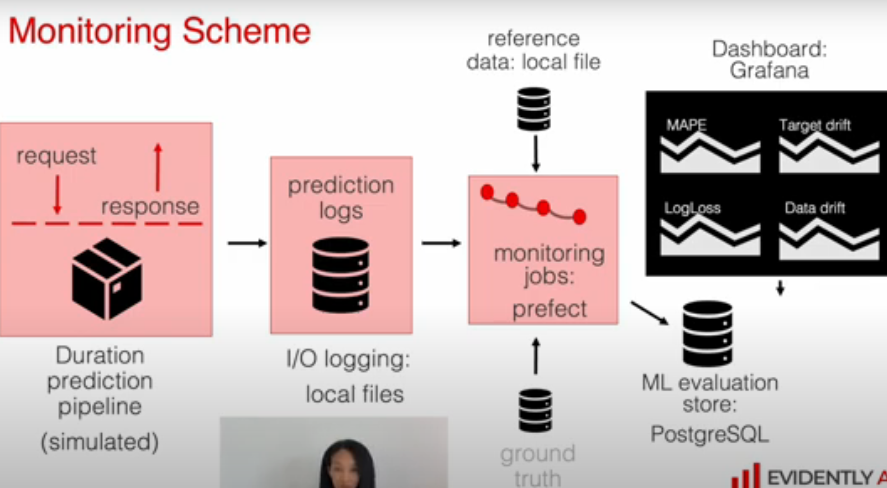

## Module 5 - Monitoring with Evidently

Some semplifications with respect to the scheme:

* We consider batch monitoring.
* We do not make use of a pipeline for data. We simply load the dataset in one shot, to train the model and validate it.
* We have no ground thurth to be used in the monitoring jobs.

**current data** is the batch over which we make the analysis (green trip data february 2022) and these data simulate the production data. They are analyzed on a daily base (daily metrics)
as for the <strong>reference data</strong>, we make use of the val\_data used for the **linear regression model (baseline model)** validation.
<strong>A NOTE on the concept of reference data in monitoring</strong>: the definition of reference data is use case and scenario dependent. If the objective of the monitoring is to check data drift, then current data and refence should have passed the same pre post processing in order to ease the search of true data drift. Reference can change in time. I can consider this week data as current and last week data as reference. Could be validation data (not training data, that is too mucch involved inthe model construction). Could be some held-out golden reference data..Besides, the usefulness of reference data is two-fold: in combination with current data can be used for data drift analysis. The reference alone can be used to define some expectations for the future monitored data. As an example: we don’t want that a particura feature can achieve values outside of mean +- 2std as calculated on the refererence.

The dataset for estimating the model parameters is January 2022 green trip data.
A simple preprocessing is done (filtering outliers) in the few categorical and numeric features that we retain for fitting the model:

* num\_features = ['passenger\_count', 'trip\_distance', 'fare\_amount', 'total\_amount']
* cat\_features = ['PULocationID', 'DOLocationID']

As the rows (single rides) are chronologically ordered, it is considered reasonable (for simplicity) to split this dataset in train\_data (first 30000 rows) and the remaining rows of January 2022 are the val\_data.
Grace to the use of docker compose we can connect different containers: one for postgresDB service (managed by Adminer) and one for Grafana service. The monitoring work is done with Evidently. While the orchestration of the monitoring jobs is managed by Prefect.
In Evidently various metrics (organized in categories) can be adopted for monitoring. In our case ColumnDriftMetric, DatasetDriftMetric, DatasetMissingValuesMetric are chosen for the analysis. In particular ColumnDriftMetric is applied to the prediction column to check for predictions drift. The Evidently tool for summarizing the analysis is the Report, that can be shown in HTML, JSON or Python dict format. 
Once created the report for the daily monitoring of February 2022, a dashboard with different visualizations can be built in Grafana GUI.
The last part of the week is dedicated to debugging. By inspecting the visualizations in Grafana, a segment of the current data (February 2022) is focused as being problematic (too high values of data drift metric on February,2). For these data a Test suite containing some Test presets is executed to check data behaviour against some thrsholds.
<strong>Difference between test suites and reports for debugging purposes</strong>: test suites tend to be more specific to respond to questions like if the current values are below/above some thresholds. Reports show more rich analysis, that can be used to show to stakeholders the reasons for interventions after monitor alerts.

 
